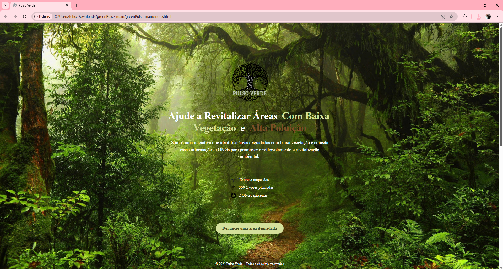

# 🌱 Green Pulse

O **Pulso Verde (Green Pulse)** é um sistema voltado ao **monitoramento de áreas urbanas** com baixos índices de vegetação, altos níveis de poluição e condições climáticas desfavoráveis.  

O projeto funciona como um **banco de dados ambiental**, coletando e armazenando informações sobre essas regiões. Esses dados podem ser compartilhados com **organizações não governamentais (ONGs)** que atuam em prol da melhoria da qualidade ambiental.  

📌 O objetivo principal é **fornecer informações que auxiliem ações ambientais**, como o plantio de árvores e vegetação, contribuindo para a recuperação de áreas degradadas.  

---

## 🌍 Objetivo
- Mapear e monitorar áreas urbanas em situação de degradação ambiental.  
- Compartilhar informações com ONGs e entidades voltadas à preservação.  
- Incentivar iniciativas de **plantio de árvores e recuperação ambiental**.  

---

## 💻 Tecnologias

---

## 🚀 Versão Beta

Foi desenvolvido um **site beta**, disponível neste repositório, para **ilustrar a utilização do sistema** e demonstrar como é possível **contribuir com o projeto**.  

Embora seja uma implementação simples em **HTML + CSS + JavaScript**, já mostra de forma eficaz o funcionamento básico da ideia.  

🔗 Para acessar, basta abrir o arquivo `index.html` no navegador.  

##

